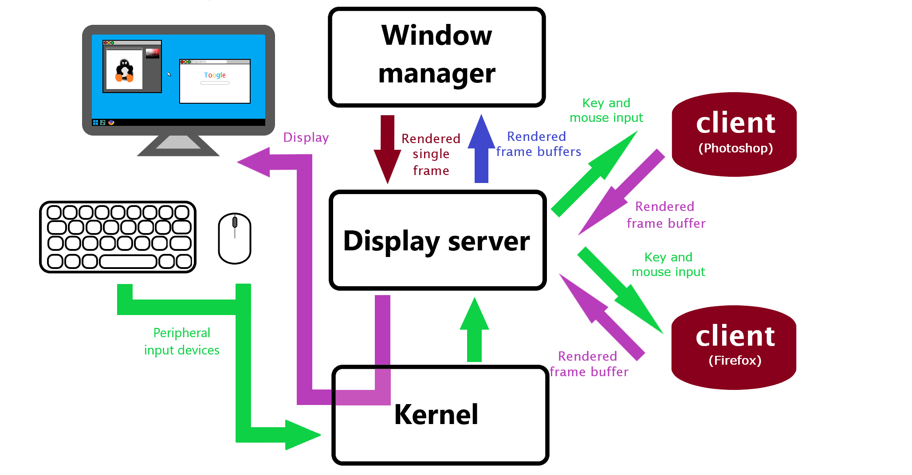

# User interfaces

Most definitely, every reader has interacted with a computer before. But most likely there was no
direct interaction with the kernel. Not only is it tedious to interact with the kernel but also
extremely time consuming. This is where the user interfaces (UIs) come to help.

## The shell

The shell is the outermost layer of an OS. Users interact with the shell to start, pause and quit
programs. Most readers will be familiar with a *graphical user interface*, GUI for short. GUIs come
with a desktop and a taskbar where programs can be started by clicking on the icon. A GUI provides
graphical windows that can be moved around with a mouse or a trackpad. Fortunately for users GUIs
hide away a lot of the complexity of the OS. Users might think that their browser such as Chrome or
Firefox is the only program that is running when they click their browsers icon in the taskbar. But
actually many other programs are already running before users even get to see their desktops taskbar,
let alone their login screen. Traditionally computers were accessed using a *command line interface*
(CLI) that only provide monospaced character output, sometimes even only in monochrome, meaning one
color on black background. CLIs don't use a lot of system resources. This is due to the fundamental
difference in architecture between GUIs and CLIs.

## Windowing systems

GUIs are made of programs that facilitate windows, icons, menus and pointing with a cursor. One of 
the components is a program called the display server. It is responsible for the communication of all 
the programs that have a graphical output. This communication occurs through a display server protocol
and the programs communicating with the display server are its clients. In windowing systems every
program has its own *window buffer*. It is a dedicated area in memory that the graphical program can
render its own graphical output to. Whenever the program has finished rendering its own window it will
message the display server over the aforementioned display server protocol. The display server has
access to all the window buffers and creates a single frame for a computer screen out of all the
windows in a routine called *compositing*. In some windowing systems there is a separate process that
composits the windows, namely a *window manager*. The window manager, as a separate process or not,
draws the windows and their borders and may add effects such as transparency or gaussian blur. It will
factor in the Z-order which is the ordering of windows from back to front and draw the windows in to a 
frame buffer accordingly. As a last step it will also draw the cursor at the cursor position.

### Rendering

Every program is responsible for rendering its own window buffer. This includes but is not limited to:

- font rendering
- drawing of images
- widgets such as text input fields and checkboxes

Together they form the magnificent windows and desktop background pictures we know and love. But rendering
is a (relatively) time consuming and complex process. However, most windowing systems will also include 
font rendering tools that are optimized for speed and accuracy. There is no point in every program having 
its own font rendering tool as there is no point in reinventing the wheel. There are some other tools for
faster rendering of shapes and images provided by either the display server itself or an extension
thereof.

### Input

GUIs are heavily reliant on mouse input to drag, resize and reordering windows, but keyboard input
is just as important for a enjoyable user experience. There may be multiple windows running
simultaneously and all of them are waiting for input. Input from external devices is handled by the
kernel. The display manager more or less exclusively acquires the exclusive right to the system input     
and decides whom to send key strokes or pointer events such as scrolling or rightclick. Additionaly
the display server will check if the input received from the kernel requires a window focus change.
Focus indicates the selected window which will get user input. If the display server notices that
the user has clicked on a window outside of the current window with focus it will transfer the focus
to the new window and change its Z-order to bring it to the front.

Clients ask the server for key and mouse input and render their own window. When an applications
window has been updated, the client application will communicate the changes to the display server.
The display server takes care of input. Kernels are system resource managers and one of those system
resources is the computer monitor

The display manager will also
check wether a click has been made on the window bar buttons such as close, minimize or maximize. The
display manager will merely tell the program that it has been resized and the program will redraw its
buffer according to the new dimensions of its window. 

## CLI

Command line interfaces are a text-only interface that put emphasis on speed, practicality and
efficency. The are purely controlled by the keyboard and are operated by entering
commands into to the command prompt.The commands are processed by a program called *command
interpreter*. The term _shell_ was associated with command line interpreter but today it has gotten
a bit of the meaning _user interface_ as well. The command line interpreter is a program that awaits
textual commands to invoke a program. A program can be started by typing its name into the shell. The
shell evaluates the input of the user. Valid input can be one of the following:

- A shell built-in command
- Full or relative path of an executable program or a program name with its path in the *PATH* _environment variable_.
- Interactive scripting keywoards 

### Shell built-ins

Many functionalities that are available to a user are *programs*. Some of those programs do such primitive
tasks and encapsulating them in a separate program (i.e. not part of the command line interpreter) would
be too much of an overhead. These small functionalities are called *commands* instead of program because
they are provided by the command line interpreter itself. Examples of such commands are *cd*/*chdir*, which
is used to change the *current working directory* or *help*, which is used to display helpful information
about the command line interpreter.

### Executables

Executables are files that can be *run*. They are sometimes called *programs* but executables refer
strictly to the files, specificly files containing *instructions and data*. Whenever their name is
typed into the command prompt, the executable is run and when finished, the user will be returned to
the prompt. However, there are multiple types of files. A JPEG image is a excellent container for
photographs and pictures but it is a terrible format to store instructions and data for a computer.
It is a bad idea to execute a JPEG file because the instructions contained within the file are garbage
at best or nefarious (such as malware) at worst. Operating systems have mechanisms to deter users from
running non-executable files but the OS itself has to know wether a file is runnable or not. These files
are identified in some operating systems by their _extension_ or their _file signature_. An extension is
a small appendix to the file name. It is of format `filename.extension`. The Windows NT family of operating
systems relies heavily on extensions to differentiate between executables and regular files.

#### Binary executables

The executable files used on DOS since the 90' and its descendants (like Windows) use a format called the MZ
executable. The MZ file format has been upgraded multiple times over the course of history. Its latest revision
is called the Portable Executable (PE) and is merely built on top of the MZ format. The extension used for
MZ and PE is typically **.exe** to identify *binary executables* i.e. instructions and data for the
processor. Windows supports most DOS legacy formats due to backwards compatibility. These includes formats
such as **.COM**. The default command line interpreter on Windows CMD is the graphical version of the
text-only DOS command line interpreter and is used to start programs and navigate the system. A program
name can be typed in to the prompt and DOS would execute it. Because the developers of DOS noticed that
typing out the file extension for every program is annoying, they made typing the extension obsolete.
The text editor on DOS was *EDLIN.EXE* but starting the program was done by typing `EDLIN` into the command
prompt. After typing the name of the program into the prompt, the interpreter checks wether the program name
is associated with a **.exe** or a **.com** file and if so, the program would be run and the user was able
to interact with the program until it quits, upon which the user will be prompted again. 

#### Scripts

There is also a different type of executables, namely *scripts*. Scripts are written in a human readable
scripting language. They rely on software to interprete the instructions at run time in contrast of
hardware (such as the CPU). The interpreting software is a program that contains instructions for
the CPU. Windows uses the **.bat** or **.cmd** extension for scripts written for `cmd.exe` and for
the newer PowerShell scripts with extension **.ps1** it will use `powershell.exe`. The command line
interpreter will 

#### Executables on unix-like systems

Unix-like operating systems differ greatly from Windows NT ones. They rarely rely on extensions to
identify executables but rather *file signatures*. Binary executables unix systems with the exception of MacOS
contain the "\x7fELF" signature. 

A special type of file signature can be found on
scripts. Even though they are made of plain ASCII characters the author of the file creates the
signature by him or herself. In scripts for Unix-like operating systems the format is as follows:
`#!/path/to/the/script/interpreter -parameters\n` followed by instructions in the scripting language that can
be interpreted by the interpreter specified in the path. The *shebang* ("#!") is the script signature
and tells the kernel that the program is not in a binary format such as ELF (Linux) or Mach-O
(MacOS Darwin), the unix-like counterparts to Windows *.exe* (PE). When the executable is invoked,
the kernel will first invoke the interpreter, which is a binary executable

### Environment variables

Typing out full path names of executables is very annoying when invoking commands, especially if there
are multiple directories where executables are located. Operating system designers came up with a clever
solution to circumvent the inconvenience. Every process is assigned *environment variables*. They are
made of **name -> value** pairs. Environment variables are passed from a parent process to its child.
Every process can change its own environment variables and pass them on to its child processes if it
chooses so. Environment variables are extremely useful in context of CLIs. On of those environment
variables is '´PATH´'. It is a string with the following format: '`path0:path1:path2:path3:...`' where
pathN is an absolute path to a directory and the colon `':'` in unix-like systems or semicolon `';'`
in Windows-family operating systems signifies a separator. When the user enters the name of an 
executable it will check wether it is a full path. If that is not the case the shell will check its
environment variables for `'PATH'` and look at its value. It will check every directory listed in
`'PATH'` sequentally and probe wether an executable with the specified name exists in the directory.
The command line interpreter will let the user know if it fails to find a executable with a matching
name. Environment variables are widely used nowadays but are mostly hidden from users autilizing a GUI.
The GUI will hide away most of the complexity of the OS, one of them being environment variables.

### Scripting

Users sometimes have more demanding requests of programs they wish to invoke. Users wishing to invoke a
program one hundred times would need to type in the desired programs name a hundred times. Invoking
a program over a hundred times is rather unusual in a GUI environment but in a CLI it may have its
appliances. There are **shell builtins** to get around this issue. These are tools provided by the shell
(not individual programs) that allow for primitive but nonetheless powerful scripting. Such functionality
can be used by typing in keywords such as `while`, `if`, `else`, `do` and alike. As mentioned,
the command line interpreter is a program and the implementation may vary. Some interpreters have a
slightly different syntax.

CLIs appeared in the times of teletype machines that could only display monochrome color output. All
modern monitors are capable of displaying high resolution multi-colored images and todays graphics
accelerated hardware has become cheaper and gotten fast, which resulted in GUIs prevailing over
CLIs. However, CLIs are very convenient for system administrators and automation of routine computer
tasks such as backups. Most graphical OSes come bundled with a *terminal emulator*, a graphical program
running a command line interpreter (such as CMD). This provides flexibility for people who use GUIs for their web
browsing et al. and system administrative tasks or running text-only programs.

## Remote Access

### Secure shell

### Remote Desktop
